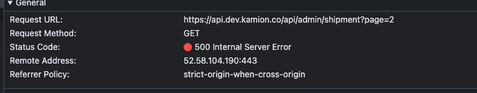
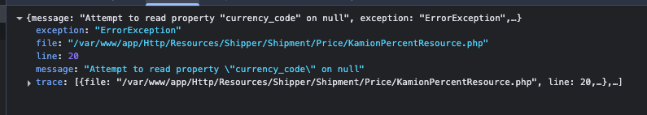

```bash
# install node module
npm install
# then
npm run dev
# or
yarn dev
# or
pnpm dev
# or
bun dev
```

Open [http://localhost:3000](http://localhost:3000) with your browser to see the result.

Dashboard sayfasında infinite scroll ile aşağı kaydırıldıkça page=2, page=3… şeklinde gelen verileri alt alta ekleyecek şekilde kurulum yapmıştım. Ancak diğer sayfalardan veri çekerken backend’den aşağıdaki hatayı aldığım için infinite scroll kısmını şimdilik yorum satırına taşıdım:

```bash
{
  "message": "Attempt to read property \"currency_code\" on null",
  "exception": "ErrorException",
  "file": "/var/www/app/Http/Resources/Shipper/Shipment/Price/KamionPercentResource.php",
  "line": 20,
  "trace": [
    {
      "file": "/var/www/app/Http/Resources/Shipper/Shipment/Price/KamionPercentResource.php",
      "line": 20,
      …
    }
  ]
}
```



